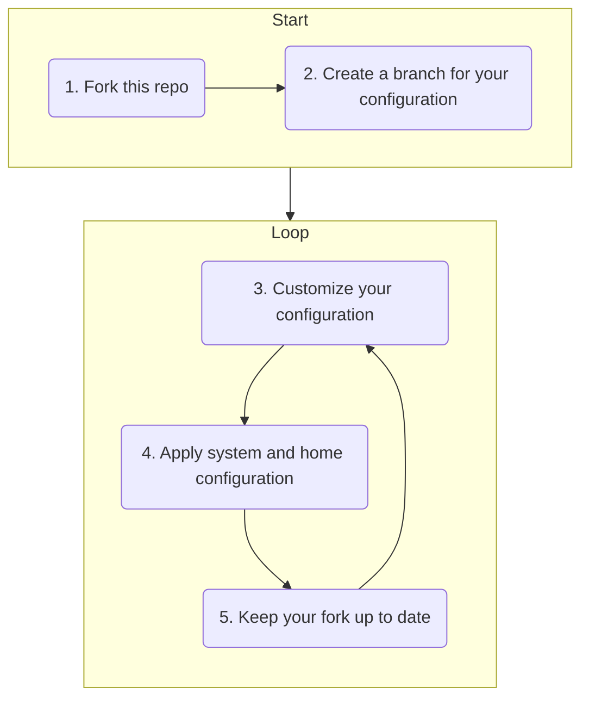

# Nix Flakes-based System & Home Configuration, Dotfiles, and Install Scripts

## CI Status

| CI Workflow                     | Target Platform                | CI Job Status                                                                                                                                                                      |
| ------------------------------- | ------------------------------ | ---------------------------------------------------------------------------------------------------------------------------------------------------------------------------------- |
| NixOS System Configuration      | NixOS                          | [![NixOS][gh-actions-nixos]][gh-actions]                                                                                                                                           |
| Home Manager User Configuration | Linux / macOS                  | [![Home Manager on Linux][gh-actions-nix-hm]][gh-actions] [![Home Manager on macOS][gh-actions-nix-hm-macos]][gh-actions]                                                                    |
| Nix-on-Droid                    | Android                        | (not implemented yet)                                                                                                                                                              |

---

Overall status: [](https://github.com/PetarKirov/dotfiles/actions)

## Overview

This repo contains my personal system configuration that consists of:

* [My config](./nixos/sys/) for [NixOS](https://nixos.wiki/wiki/NixOS)
* [My config](./nixos/home/) for [Home Manager](https://github.com/nix-community/home-manager)
* [My dconf (written in Nix)](./nixos/home/dconf.nix) for the [Gnome Desktop Environment](https://www.gnome.org/)
* [My](./utils/make_zfs.bash) ZFS partitioning and formatting script
* [My dotfiles](./.config) for [Git](https://git-scm.com/), [Fish](https://fishshell.com/), [NeoVim](https://neovim.io/), [EditorConfig](https://editorconfig.org/), [Prettier](https://prettier.io/)
* My config for [Nix-on-Droid](https://github.com/t184256/nix-on-droid) (WIP)
* [Old install scripts](./install/) (tested on: [{see CI matrix above}](#ci-status))

It [includes](./flake.nix) a [Nix Flake][nix-flakes] file which acts as an entrypoint for Nix and defines the following outputs:

* `nixosConfigurations.*` - [NixOS][nixos] system configurations
* `homeConfigurations.*` - Nix [Home Manager][home-mgr] configuration
* `nixOnDroidConfigurations.*` - [Nix-on-Droid][nix-on-droid] configuration for Nix-powered Android shell environment

## Basic Usage



### 3. Customize your configuration

You most likely want to update some of these things:

1. Git username and email - edit [this file](./.gitconfig)
2. NixOS username - edit `defaultUser` in
  [flake.nix](https://github.com/PetarKirov/dotfiles/blob/main/flake.nix#L40)
3. Commit your NixOS machine config under [`nixos/machines`](./nixos/machines)
4. Update [`home.sessionVariables`](./nixos/home/home.nix)
5. Add/remove home packages in [`nixos/home/pkg-sets`](./nixos/home/pkg-sets/)

### 4. Apply home and system configuration

* Switch to latest Home Manager configuration:
  ```bash
  home-manager switch --flake $CFG#$USER
  ```
  (no `sudo` or reboot necessary)
* Switch to latest NixOS system configuration:
  ```bash
  sudo nixos-rebuild switch --flake "$CFG#$(hostname)"
  ```
  (updating the kernel requires reboot, while changes to services (e.g. enabling
  docker, or updating the firewall rules) don't)

### 5. Keep your fork up to date

First, check your git remotes. You should have one pointing to your fork and one
pointing to this repo. In this case `petar` points to this repo and `origin`
points to yours.

```bash
git remote -v
origin  git@github.com:<your-fork>/dotfiles.git (fetch)
origin  git@github.com:<your-fork>/dotfiles.git (push)
petar   https://github.com/PetarKirov/dotfiles.git (fetch)
petar   https://github.com/PetarKirov/dotfiles.git (push)
```

(The choice of SSH for the fork and HTTPS for the original repo in the
URL schema is deliberate to signify that the original repo is read-only, while
the fork is read/write.)

Next simply pull from the original repo and rebase your branch on top:

```bash
git pull --rebase petar main
```

### Putting everything together

To update only the packages managed by home-manager (no `sudo` or restart
needed):

```bash
git pull --rebase petar main && home-manager switch --flake $CFG#$USER
```

To update everything and restart:
```bash
git pull --rebase petar main \
  && home-manager switch --flake $CFG#$USER \
  && sudo nixos-rebuild switch --flake "$CFG#$(hostname)" \
  && reboot
```

### Manually update all Nix Flake inputs

If you want to maintain a completely independent fork, or if you just want to
update dependencies on your own schedule, you can manually update the flake
inputs like this:

```bash
nix flake update $CFG
```

The versions of most software installed on the system are determined by the
Nixpkgs commit hash stored in the `flake.lock` file. Running the command above
will update it (and the other flake inputs) to latest version.

## Installing NixOS

1. Boot into a [live NixOS environment](https://nixos.org/download.html#nixos-iso)
2. Generate a `hostid` for the target system:

   ```sh
   echo "$(tr -dc 0-9a-f < /dev/urandom | head -c 8)"
   ```

3. Update `/etc/nixos/configuration.nix` of the live NixOS environment like so:

    ```nix
    { config, pkgs, ... }:
    {
      imports = [ <nixpkgs/nixos/modules/installer/cd-dvd/installation-cd-graphical-gnome.nix> ];
      networking.hostId = "<enter the hostid obtained at step 2>";
      nix = {
        trustedUsers = [ "root" "nixos" ];
        extraOptions = ''
          experimental-features = nix-command flakes
        '';
      };
    }
    ```

    ```sh
    # Open the file and change it to the snippet below:
    sudo vim /etc/nixos/configuration.nix

    # Once the file has been updated and saved, apply the settings:
    sudo nixos-rebuild switch
    ```

    These settings will ensure that you're using a recent enough version of Nix
    with the necessary features enabled and that ZFS will set the right hostid
    when partitioning the storage drive.

4. Clone this repo:

   ```sh
   git clone https://github.com/PetarKirov/dotfiles && cd dotfiles
   ```

5. Assuming that you're installing NixOS on a clean drive, run the automated ZFS partitioning tool:
   * Run it in "dry-run" mode to get information about your system:
     `./utils/make_zfs.bash`
   * If you need to partition your drive run:
     `env DRY_RUN=0 KEEP_PARTITIONS=0 ./utils/make_zfs.bash`
   * If your drive is already partitioned, run: `env DRY_RUN=0
     ./utils/make_zfs.bash`

   Now there should be a root ZFS partition mounted at `/mnt`, a boot partition
   at `/mnt/boot` and a swap partition.

6. Pick a name for the machine and generate the NixOS config, which you'll edit
   manually:

   ```sh
   export MACHINE=machine-name
   mkdir ./nixos/machines/$MACHINE
   sudo nixos-generate-config \
     --root /mnt \
     --dir  /..$(git rev-parse --show-toplevel)/nixos/machines/$MACHINE
   ```

   Your files were automatically generated under `../dotfiles/nixos/machines/$MACHINE/`.

7. Update them manually to match the format of the other machines under
   [`./nixos/machines`](./nixos/machines) (e.g. separate `file-systems.nix` file).

   Tip: use `lsblk` to list the storage devices by `partuuid`:

   ```sh
   lsblk -o KNAME,SIZE,PARTUUID,MOUNTPOINTS
   ```

8. Copy the `dotfiles` repo inside the user's home dir in order to persist the
   changes we did in the live environment

   ```sh
   sudo mkdir -p /mnt/home/$USER/code/repos
   sudo cp -a ../dotfiles /mnt/home/$USER/code/repos
   ```

9. With everything configured we can now perform the actual NixOS installation:

   ```sh
   sudo nixos-install --impure --flake ".#$MACHINE" --root /mnt
   ```

10. Now that NixOS has been installed on the target drive, chroot into it (using
    `nixos-enter`) and change the password of the default user:

    ```sh
    sudo nixos-enter --root /mnt
    passwd $THE_USER_NAME
    exit
    ```

    (Replace `$THE_USER_NAME` in the command above with the your username.)

11. Reboot into the new NixOS install and activate the home-manager config:

    ```sh
    # Home Manager generates config files for Fish which may conflict with the
    # default fish files. Delete the default ones to prevent any conflicts:
    rm -rf /home/$USER/.config/fish

    # Change the owner of the repo to your own user:
    sudo chown -R $USER ~/code

    # Build and activate Home Manager
    nix build -L --json ~/code/repos/dotfiles#homeConfigurations.$USER.activationPackage \
      | jq -r '.[].outputs | to_entries[].value' \
      | xargs -I@@ sh -c '@@/activate'
    ```

12. You're done!

## Nix Ecosystem Docs

* Find Nix packages: <https://search.nixos.org/packages>
* Browse NixOS configuration options:
  * Full list (on a single page): <https://nixos.org/manual/nixos/stable/options.html>
  * Search: <https://search.nixos.org/options>
* Home Manager docs: <https://nix-community.github.io/home-manager/>
  * Home Manager options: <https://nix-community.github.io/home-manager/options.html>
* Nix Language
  * Overview: <https://nixery.dev/nix-1p.html>
  * Nix cheatsheet: <https://learnxinyminutes.com/docs/nix>
  * Interactive tour of Nix: <https://nixcloud.io/tour/?id=1>
  * Official docs: <https://nixos.org/manual/nix/stable/expressions/writing-nix-expressions.html>
* Nix Flakes
  * An introduction: <https://christine.website/blog/nix-flakes-1-2022-02-21>
  * Official docs: <https://nixos.org/manual/nix/stable/command-ref/new-cli/nix3-flake.html>
* Cachix: <https://www.cachix.org>
* Nix Direnv: <https://github.com/nix-community/nix-direnv>
* Direnv: <https://direnv.net/>

[nixos]: https://nixos.org/
[home-mgr]: https://github.com/nix-community/home-manager
[nix-on-droid]: https://github.com/t184256/nix-on-droid
[nix-flakes]: https://nixos.org/manual/nix/stable/command-ref/new-cli/nix3-flake.html

[gh-actions]: https://github.com/PetarKirov/dotfiles/actions

[gh-actions-nixos]: https://github-actions.40ants.com/PetarKirov/dotfiles/matrix.svg?only=ci.nixos
[gh-actions-nix-hm]: https://github-actions.40ants.com/PetarKirov/dotfiles/matrix.svg?only=ci.nix-hm
[gh-actions-nix-hm-macos]: https://github-actions.40ants.com/PetarKirov/dotfiles/matrix.svg?only=ci.nix-hm-macos
